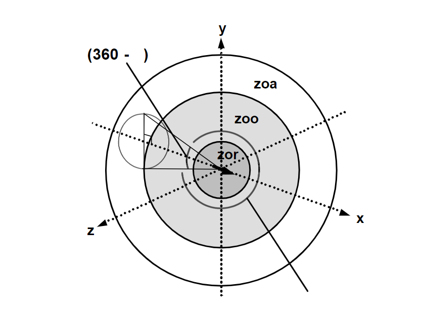

# Shark Art-tack

Ancient creatures roam through the depths and breadths of ocean basins. Their size, their jaws, their might, and their electroreceptive abilities are some of the qualities that inspire both awe and fear of these apex predators. But how do sharks go about in their predation?

In contrast to cultural depictions of the lone hunter, many shark species [hunt collectively](https://esajournals.onlinelibrary.wiley.com/doi/10.1002/ecy.3117). Ecologist Mourier argues this feeding pattern is a demonstration of how "sharks can use collective behavior with simple rules to benefit and increase their [fitness](https://www.psychologytoday.com/ca/blog/animal-minds/202006/the-sharks-hunt-in-packs#:~:text=It%20is%20the%20hunting%20grounds,The%20sharks%20hunt%20in%20packs.)". 

Our objective, then, was to simulate sharks gathering around a feeding ground in order to assess potentially relevant parameters governing these 'simple rules' in collective hunting. 

Our inspiration were patterns we observed in a [documentary](https://www.youtube.com/watch?v=zeEUgZlogkM&ab_channel=BlueWorldTV) in which divers would regularly feed sharks in the Bahamas for research purposes. See the figure below for a snapshot from the documentary

## The Model 

The simulation of collective hunting takes into account the following parameters: velocity of shark, position of shark, hunger level, which in turn influences proximity to food source, and repulsion from other sharks. 

How it works:
We adopted a simplified 3D swarming model defined by [Couzin et. al](https://pubmed.ncbi.nlm.nih.gov/12297066/) and modified it to take feeding into account.
The position $(r_i(t))$ and direction $(v_i(t))$ of each shark at every time-step $\tau$ changes according to a set of rules. 
In general:
$$v_i(t + \tau) = v_i(t) + a_i(t)\tau$$
$$r_i(t + \tau) = r_i(t) + v_i(t)\tau$$
where $a_i(t)$ is a measure for the net interaction of one shark with all the others and the feeding point. $v_i$ is fixed in magnitude.

### Modeling shark-shark interactions:
For every shark with parameters $(r_s, v_s)$, three zones of interaction are identified (from smallest to largest): 
1. zone of repulsion (zor): A number of $N_r$ sharks inside this zone contribute to $a_i$ by a repulsive component
    $$a_r = -\sum_{j = 0}^{N_r}\frac{r_j - r_s}{|r_j - r_s|^n}.$$
    This simulates the size of each shark. The exponent $n$ is a parameter that we let vary.
2. zone of orientation (zoo): A number of $N_o$ sharks inside this zone contribute to $a_i$ by tending to align neighbouring sharks:
    $$a_o = \frac{1}{\tau}\sum_{j=0}^{N_o}v_j.$$
      A shark tends to align it's direction according to it's nearest neighbours inside this zone.
3. zone of attraction (zoa): Outside the zoo, sharks are generally drawn towards each other using an attractive force
    $$a_a = \sum_{j=0}^{N_a} \frac{r_j - r_s}{|r_j - r_s|^m}.$$
    Sharks that are separated far from each other tend to be attract.

&nbsp; &nbsp; &nbsp; &nbsp;

### Modeling shark-food interactions:
We measured a sharks appetite with a ``hunger`` parameter $(h)$. If an individual has recently eaten, it will be close to 1 and diminish over time with a personalized (i.e. randomized for each shark) decay-rate. At every time-step, a shark decides to go for food with a probability

$$p(\text{"goes for food"}) = \exp(-8h).$$

If this decision has been made by a shark it turns into a hungry shark and will ignore the above rules (2) and (3) and head towards the food source. The ``hunger`` parameter is replenished back to 1, if the shark has entered a feeding-zone around the diver and the above rules are reinstated again. A hungry shark is drawn towards the food source by 

$$a_f = -c\frac{r_s}{|r_s|}.$$

where $c$ is a constant.

## The Visualization

Art moves the soul . In this visualization, the collective movement of sharks in turn produces a simple yet mesmerizing pattern of dynamic interactions, balanced between attraction towards the food source and repulsion in space from others, to yield a state in which nourishment of the soul is achieved, both of the sharks, and of the perceiver of this beautiful simulation. 
